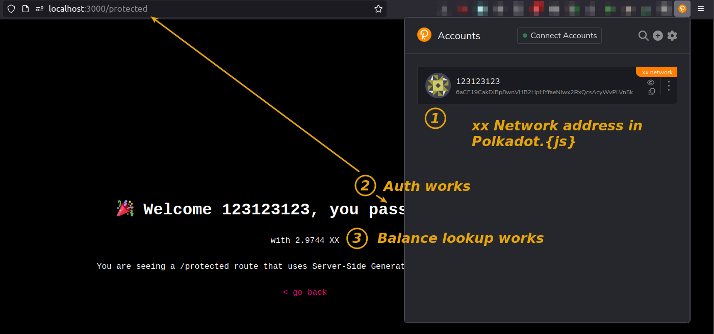

- [README for xx Network](#readme-for-xx-network)
- [How to run](#how-to-run)
- [Use cases](#use-cases)
- [What modified and why](#what-modified-and-why)
- [Known issues](#known-issues)
  - [Address format](#address-format)
  - [Asset-gating](#asset-gating)


## README for xx Network

(See [KSM_README.md](./KSM_README.md) for upstream README document.)

What it is:
- Make access to your site "gated" only to users with a certain amount of xx coin or a xx Network asset in their Web3 wallet (works with Polkadot{.js})
  - You can set that balance to any amount (10, 100, 100,000 XX) or mandate different balances for different paths on your Web site
  - Works with static and dynamic Web pages
  - Both token- and "asset"-gating works. The check for (xx Network) asset kind and balance is currently CLI only (see in Known issues at the bottom). 



Thank you to [the original author](https://polkadot.study/tutorials/tokengated-polkadot-next-js/intro) and the guy who [forked it](https://github.com/yk909/polkadot-js-tokengated-website/) to apply some fixes (verify/compare if you plan to use in production, of course).

I'm sharing in the hope someone will use it for xx Network or other Substrate projects/chains for which the upstream forks don't provide instructions. 

## How to run

Install Polkadot{.js} extension, create xx Network wallet, fund it with some amount of xx coins (1.01, for example) and set it to work on `xx Network`.


Download this repo, create `.env.local` in root directory, and run:

```sh
cp .env.local.example .env.local
vim .env.local
npm run dev
```

My .env.local for non-production use:

```raw
NEXTAUTH_SECRET=123123123
NEXTAUTH_URL=http://localhost:3000
RPC_ENDPOINT=ws://192.168.1.30:63007
```

Go to http://localhost:3000 in the browser in which you installed Polkadot{.js} and connect the extension to http://localhost:3000, generate an address and make it restricted for use on xx Network (I hoped this would ensure balance will be looked up correctly, but it was not).

With that, I can login (see [xx_screenshot.png](./xx_screenshot.png) and balance of xx coins is correctly shown (since v1.1)). 

(Note that, if you go to https://wallet.xx.network, Polkadot{.js} lets you add the wallet from the browser extension and show it in xx Network Wallet. Neat!)

`npm run build` builds okay, but has a fake warning about multiple versions of some package.

## Use cases

Obviously, token-gating Web sites. But, in the context of xx Network, what kinds?

- Generic infrastructure services for validators - many of whom are too cheap to pay for anything, and too lazy or privacy-conscious to register
- Access to xx Network-related services such as Haven Space directory

Because token-gating only works for *checking* the free balance, site owner can't "deduct" any money from user's wallet. 

That may seem useless - at least with "NFT token-gating" they could have something to sell (NFT for site/service access), but what I think people sometimes miss is the fact that:

- site owner can get paid "out of band"
- site owner can check if the address has transferred xx coin to the site this month 
- site owner can pre-populate form fields with wallet/address used to log in, and provide service to addresses that have already paid

So this integration is not entirely useless even for sites that can't sell xx coin to their members.

## What modified and why

`.env.local` and `pages/api/auth/[...nextauth].js` line 92 there's a fall back to public RPC endpoint, but I modified that one to local as well. 

In `components/login.tsx` I added some functions for debugging, and logging to console.

In `pages/protected-api.tsx` and `pages/protected.tsx` ("static" protected page), changed KSM to XX and changed the number of decimals to 9 from 12:
```sh
const ksmBalance = formatBalance( session.freeBalance, { decimals: 9, withSi: true, withUnit: 'XX' } )
```
All modified pages from yk909's fork (you can see in Commits):

```sh
modified:   components/account-select.tsx
modified:   components/login.tsx
modified:   package-lock.json
modified:   package.json
modified:   pages/api/auth/[...nextauth].ts
modified:   pages/protected-api.tsx
modified:   pages/protected.tsx
```

## Known issues

### Address format

Internally, the xx wallet address is shown in generic Polkadot format, which is fine - the same private key could be used with a number of Substrate chain addresses.

```raw
token {
  name: '123123123',
  sub: '5GxeeFALkRvjnNgkiMjiP6q2GGnZ1ZmFyjCusHG4VoezqZSN',
  freeBalance: '0x000000000000000000000000b14a8cbc',
  iat: 1729956938,
  exp: 1732548938,
  jti: '3252212b-0fb2-4a82-88d0-3ceaf5886aa1'
}
```

The FAQs say [it's normal to see another address](https://polkadot.js.org/docs/keyring/FAQ#my-pair-address-does-not-match-with-my-chain).

You can configure the wallet to default to xx Network, by the way (see the screenshot), to avoid that.

### Asset-gating 

Currently it works only in the console and it may be xx Network-specific (e.g. it seems Polkadot doesn't use Assets, so if you want to reuse this with another coin maybe check if it supports assets). 

In the code we check the balance of asset ID 5 (which on xx Network happens to be `JUNK`) and warn if it's less than 2. I have 1 on mine, which triggers a warning like so.

```raw
ksmAddress:  6aCE19CakDJBp8wnVHB2HpHYfaeNiwx2RxQcsAcyWvPLVn5k
Wallet address on xx Network:  6aCE19CakDJBp8wnVHB2HpHYfaeNiwx2RxQcsAcyWvPLVn5k
Wallet balance on xx Network:  1840527453
Account balance for asset 5 and address 6aCE19CakDJBp8wnVHB2HpHYfaeNiwx2RxQcsAcyWvPLVn5k: 1
Warning: Account balance for asset 5 is less than 2.
token {
  name: 'the-dude',
  sub: '5GxeeFALkRvjnNgkiMjiP6q2GGnZ1ZmFyjCusHG4VoezqZSN',
  freeBalance: '0x0000000000000000000000006db4385d',
  iat: 1730995852,
  exp: 1733587852,
  jti: 'c7a8e87a-0bff-46da-a5be-ffc51726d6dc'
}
```

Showing this information in the UI is a TODO item. You may find more on asset-checking ideas [here](https://armchairancap.github.io/blog/2023/11/05/xx-network-asset-gated-access).
